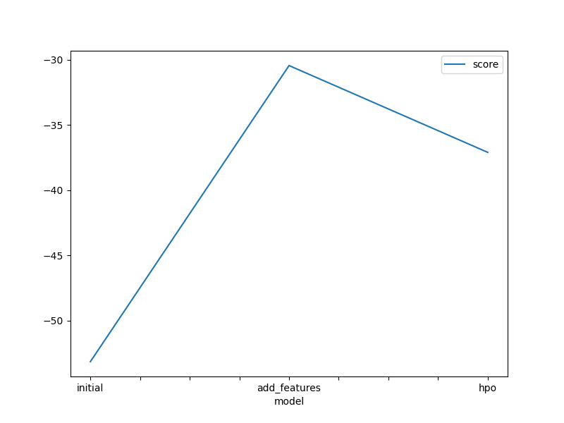
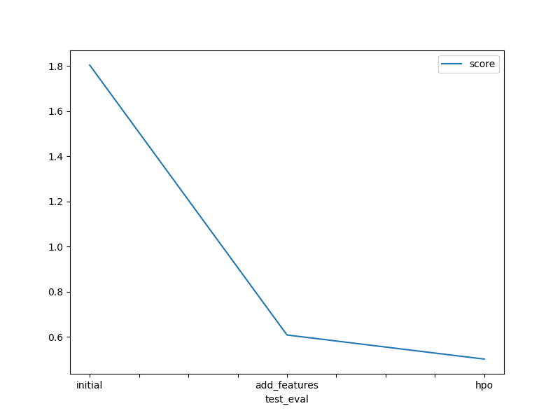

# Report: Predict Bike Sharing Demand with AutoGluon Solution
#### NAME HERE

## Initial Training
### What did you realize when you tried to submit your predictions? What changes were needed to the output of the predictor to submit your results?
The data could not have negative values and must be in the format specified by the 'sampleSubmission.csv' file.

### What was the top ranked model that performed?
Best model came after the hyperparameter tuning with WeightedEnsemble_L3 and a score of 0.50209.

## Exploratory data analysis and feature creation
### What did the exploratory analysis find and how did you add additional features?
That the datetime was in the wrong format. Splitting into day, month and hour showed that there were variations in the day and month that should be included in the model. Year did not show significant variation and was not included.

### How much better did your model preform after adding additional features and why do you think that is?
It dropped from 1.80354 to 0.60881. Adding the day and month helped to increase the predictive power of the model.

## Hyper parameter tuning
### How much better did your model preform after trying different hyper parameters?
It decreased from 0.60881 to 0.50209 from hyperparameter tuning. 

### If you were given more time with this dataset, where do you think you would spend more time?
I would focus more on the hyperparameter tuning and try different algorithms to test.

### Create a table with the models you ran, the hyperparameters modified, and the kaggle score.
|model|hpo1|hpo2|hpo3|score|
|--|--|--|--|--|
|initial|None|None|None|1.80354|
|add_features|None|None|None|0.60881|
|hpo|ensemble_size|num_base_models|model_weights|0.50209|

### Create a line plot showing the top model score for the three (or more) training runs during the project.

### Create a line plot showing the top kaggle score for the three (or more) prediction submissions during the project.

## Summary
Introducing the day, month and hour features imporved the score, as did some initial hyperparemetr tuning. More tuning would be required to get a more accurate model in the future, that performs better. Only one model was tested for hyperparameter tuning, more should be tested in the future. 